# Parcial 1: Sistemas Distribuido

-  Camilo Penagos A00301416
-  Cristian Duque A00301448

## Arquitectura

-  Un productor de mensajes
-  Un broker de RabbitMQ
-  Dos consumidores de mensajes
-  El primer consumidor recibirá los mensajes de la cola "Grupo1"
-  El segundo consumidor recibirá los mensajes de la cola "Grupo2"
-  Ambos consumidores recibirán los mensajes enviados al grupo "General"

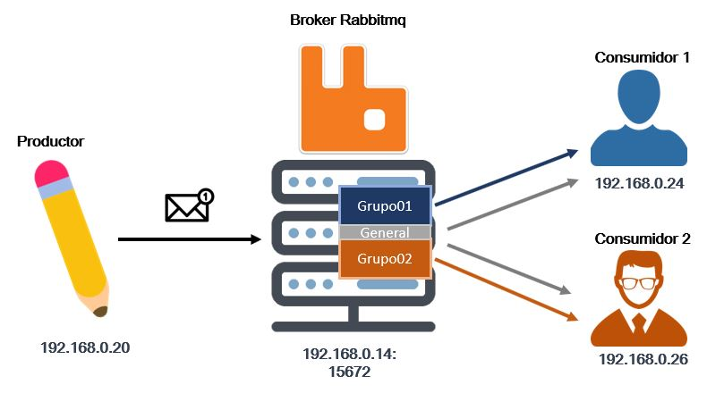

## Procedimiento

Para cumplir con el objetivo del ejercicio parcial, es necesario montar un sistema de arquitectura distribuida que consiste en:

**Un Servidor Broker:** Corresponde a la maquina fisica host ubuntu con la dirección IP 192.168.0.14

**Un Productor de mensajes:** Corresponde a una maquina virtual guest Lubuntu con la dirección IP 192.168.0.20

**Un Consumidor 01:** Corresponde a una maquina virtual guest Lubuntu con la dirección IP 192.168.0.24

**Un Consumidor 02:** Corresponde a una maquina virtual guest Lubuntu con la dirección IP 192.168.0.26  

### Broker

EL broker es el servidor encargado de gestionar las transacciones o mensajes entre el producto y los consumidores. El servidor permite almacenar los mensajes y gestionarlos segun el tema de interés y almacenar estos mensajes en las colas correspondientes, de manera que los clientes que se suscriben a esas colas de mensajes puedan consumir acceder a los mensajes almacenados.

Primero, ingresamos como usuario root con el comando sudo su. Luego continuamos con los siguientes comandos:

`apt-get update`

`apt-get install erlang`
Erlang contiene es una dependencia para rabbitmq y permite tener un entorno de ejecucción.

`apt-get install rabbitmq-server`

Intalar el servidor de rabbitmq

`systemctl enable rabbitmq-server`

Habilitar el servicio de rabbitmq

`systemctl start rabbitmq-server`

Iniciar el servicio de rabbitmq

`systemctl status rabbitmq-server`

Con este comando se verifica que efectivamente el servicio de rabbitmq se encuentra habilitado y corriendo, como se observa en la imagen.

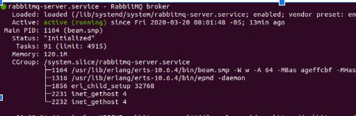

Por ultimo se verifica que el servicio ha sido instalado en localhost y puede ser accesible por la interfaz web de administración usando el puerto 15672

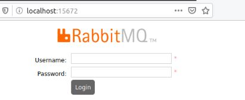

### Productor

El productor consiste en un script de python, que se encarga de enviar mensajes a los consumidores seteado con un tema específico. El mensaje consiste en dos partes, en el primer campo se especifica el destinatario y el segundo campo se evidencia el contenido del mensaje. En la imagen se evidencia como se hace el envio por parte de un productor.

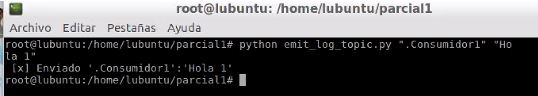

El script de python que permite aprovisionar la maquina virtual como un productor se mensajes se encuentra [aqui](ArchivosParcial/emit_log_topic.py).

### Consumidores

Se cuenta con dos consumidores los cuales tienen un solo tema(topic) de interes y ademas reciben los mensajes enviados al grupo genereal.El consumidor cuenta con un script en python que recibe solos los mensajes que van dirigidos a su grupo o topic, y tambien recibe los mensajes que son enviado para el topic General. El consumidor tiene un tema de interes y recibe los mensajes que el emisor envia de ese tema(topic) especifico y se guardan en un cola de mensajes del broker.

## Funcionamiento - Validación

Para completar exitosamente el ejercicio parcial, se debe verificar que los consumidores reciben los mensajes del productor, cuando este los envia con el tema(topic) al que los consumidores se han suscripto.

### Grupo-01
En este primer escenario, el productor envia un mensaje de prueba que corresponde al topic de interes de ese consumidor. Este mensaje se almacena en la cola del broker "Grupo-01". Como el consumidor uno (1), se encuentra suscrito a esa cola de mensajes recibe efectivamente los mensajes. En las siguientes imagenes se evidencia: En primer lugar el mensaje que el productor ha enviado al consumidor uno, el mensaje ha sido recibido correctamente por el consumidor uno y por ultimo se encuentra la cola de mensajes que esta en el broker que corresponde al topic Grupo-01.

Se evidencia como el productor envia correctamente un mensaje de saludo, al consumidor uno.

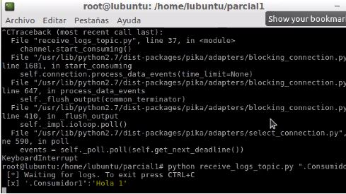

Se evidencia que el mensaje fue recibido por el consumidor uno, que tiene como topic de interes el Grupo-01

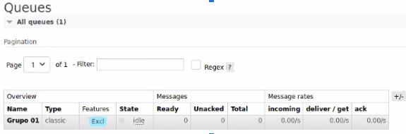

Cuando se accede por la interfaz web de administración del broker, se evidencia que la cola de mensajes correspondiente al Grupo-01, efectivamente ha sido creada y es aqui donde se almacenan los mensajes enviados a los consumidores de este topic. En este caso el mensaje que ha sido enviado al consumidor uno (1).

### Grupo-02
Para el segundo escenario se debe repetir el procedimiento, pero esta vez se busca verificar que el productor envia correctamente mensajes al consumidor dos (2). Este consumidor tiene como topic de interes el Grupo-02 y recupera los mensajes de la cola de mensajes Grupo-02 del servidor broker.

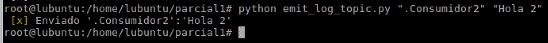

Se evidencia como el productor envia correctamente un mensaje dirigido al consumidor dos.

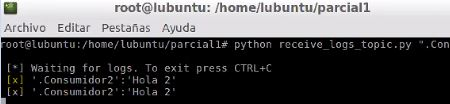

Se evidencia que el mensaje fue recibido por el consumidor dos,ya que tiene como topic de interes el Grupo-01 y se encuentra suscrito a este topic en el broker.

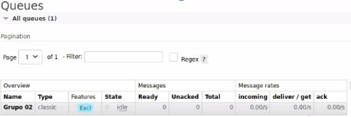

Cuando se accede por la interfaz web de administración del broker, se evidencia que la cola de mensajes correspondiente al Grupo-02,  ha sido creada correctamente en el broker y es aqui donde se almacenan los mensajes enviados a los consumidores de este topic. En este caso el mensaje que ha sido enviado al consumidor dos(2).

### General
En el ultimo escenario se evidencia que los dos consumidores que han sido creado, aunque estan suscritos a topics de interes distintos estos reciben los mensajes que sean enviados al grupos general como se solicita en el enunciado del parcial. Para validar el correcto funcionamiento se debe enviar un mensaje de parte del productor con destino "general" y verificar que efectivamente los dos consumidores han recibido el mensaje.

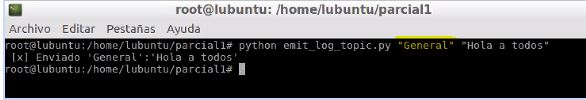

Se evidencia que el mensaje emitido por el productor tiene como destino el grupo "general".

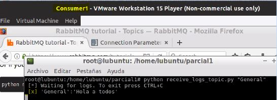

En la imagen se evidencia que la maquina virtual correspondiente al consumidor uno(1) ha recibido correctamente el mensaje que ha enviado el productor.

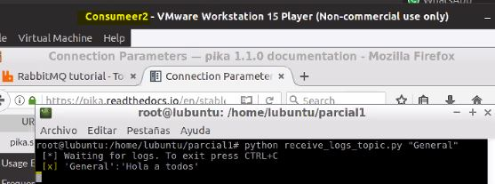

De igual forma se evidencia que el segundo consumidor aunque pertenece a un topic diferente, ha recibido correctamente el mensaje enviado al grupo general por parte del emisor.

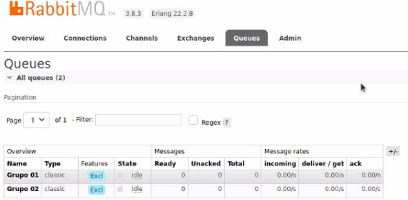

De igual forma se evidencia que han sido creadas dos colas correspondientes a los grupos de los consumidores, es decir la cola de mensajes para el grupo 01 y grupo 02. Es decir no se ha creado una cola de mensajes para el grupo general, si no que los mensajes de este grupo se almacenan en ambas colas de manera que los consumidores puedan acceder a esos mensajes.

## Problemas

## Referencias

-  RabbitMQ Topics : https://www.rabbitmq.com/tutorials/tutorial-five-python.html
