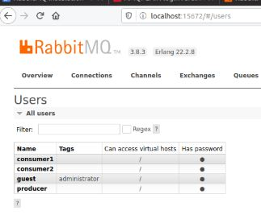
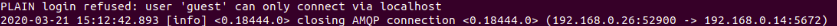
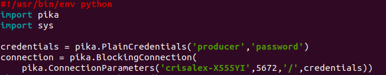

# Parcial 1: Sistemas Distribuidos

-  Camilo Penagos A00301416
-  Cristian Duque A00301448

## Arquitectura

-  Un productor de mensajes
-  Un broker de RabbitMQ
-  Dos consumidores de mensajes
-  El primer consumidor recibirá los mensajes de la cola "Grupo-01"
-  El segundo consumidor recibirá los mensajes de la cola "Grupo-02"
-  Ambos consumidores recibirán los mensajes enviados al grupo "General"

## Procedimiento

Para cumplir con el objetivo del ejercicio, es necesario montar un sistema de arquitectura distribuida compuesto por:

**Un Servidor broker:** Corresponde a una máquina física Ubuntu con la dirección IP 192.168.0.14

**Un Productor:** Corresponde a una máquina virtual Lubuntu con la dirección IP 192.168.0.20

**Un Consumidor 01:** Corresponde a una máquina virtual Lubuntu con la dirección IP 192.168.0.24

**Un Consumidor 02:** Corresponde a una máquina virtual Lubuntu con la dirección IP 192.168.0.26  

### Broker

Actúa como servidor rabbitmq, encargado de gestionar las transacciones de mensajería entre el productor y el(los) consumidor(es). Además, permite almacenar y gestionar los mensajes en las colas correspondientes; de manera que los clientes que se suscriben a esas colas, puedan acceder y consumir esos mensajes.

Para su instalación, ingresamos como usuario root con el comando "sudo su". Luego, continuamos con los siguientes comandos:

`apt-get update`
Instalar actualizaciones en el sistema

`apt-get install erlang`
Instalar Erlang dado que es una dependencia para rabbitmq y provee un entorno de ejecución.

`apt-get install rabbitmq-server`
Intalar el servidor rabbitmq

`systemctl enable rabbitmq-server`
Habilitar el servicio de rabbitmq

`systemctl start rabbitmq-server`
Iniciar el servicio de rabbitmq

`systemctl status rabbitmq-server`
Con este comando se verifica que efectivamente el servicio de rabbitmq se encuentra habilitado y corriendo, como se observa en la imagen:

Por último, para poder acceder a la interfaz web de administración del servidor, debemos ingresar el siguiente comando "rabbitmq-plugins enable rabbitmq_management". Ahora, ingresamos a localhost por el puerto 15672 mediante nuestro navegador:

-  En el servidor broker se evidencia que, cada uno de los agentes involucrados en la solución están registrados en el servidor con su respectiva credencial:

Nota: Se usará python para el desarrollo de este ejercicio tanto en el productor como los consumidores. Para ello, vamos a instalar Pika que implementa el protocolo de mensajería AMQP usado en rabbitmq. Para su instalación, ingresamos el siguiente comando: sudo apt-get install python-pika.

### Productor

Se crea en un script de python, que se encarga de enviar mensajes a los consumidores configurado con un tema específico. El mensaje contiene dos partes: En el primer campo se especifica el destinatario y el segundo campo va el contenido del mensaje. En la imagen se evidencia el envio de un mensaje por parte de un productor:

-  El script de python que permite aprovisionar la maquina virtual como un **productor** de mensajes se encuentra [aqui](ArchivosParcial/emit_log_topic.py).

### Consumidores

Se cuenta con dos consumidores, los cuales tienen un solo tema(topic) de interés y reciben los mensajes enviados al grupo  "General". Cada consumidor cuenta con un script en python que recibe; los mensajes que van dirigidos a su grupo o topic, y los mensajes que son enviados para el topic "General". Estos mensajes provenientes de un productor, se guardan en un cola de mensajes en el broker.

-  El script de python que permite aprovisionar la maquina virtual como un **consumidor del Grupo-01**  se encuentra [aqui](ArchivosParcial/receive_log_consumer1.py).

-  El script de python que permite aprovisionar la maquina virtual como un **consumidor del Grupo-02** se encuentra [aqui](ArchivosParcial/receive_log_consumer2.py).

## Funcionamiento - Validación

Para completar exitosamente el ejercicio, se debe verificar que los consumidores reciben los mensajes del productor, cuando éste los envia con el tema(topic) al que los consumidores se han suscrito.

### Grupo-01
En este primer escenario, el productor envía un mensaje de prueba que corresponde al topic de interés del consumidor perteneciente a ese grupo. Este mensaje se almacena en la cola del broker "Grupo-01". Como el consumidor uno (1), se encuentra suscrito a esa cola de mensajes, recibe efectivamente los mensajes. En las siguientes imágenes se evidencia: En primer lugar, el mensaje enviado por el productor; en segundo lugar, el mensaje que ha sido recibido correctamente por el consumidor; y por último, la cola de mensajes que está en el broker:

El productor envía correctamente un mensaje de saludo, al consumidor 1.

El mensaje fue recibido por el consumidor 1, que tiene como topic de interés: Grupo-01

Acceder por la interfaz web de administración del broker, se evidencia que la cola de mensajes correspondiente al Grupo-01, efectivamente ha sido creada y es aquí donde se almacenan los mensajes enviados a los consumidores de este topic. En este caso, el mensaje que ha sido enviado al consumidor 1.

### Grupo-02
Para el segundo escenario, se debe repetir el procedimiento, pero esta vez se busca verificar que el productor envíe correctamente mensajes al consumidor dos (2), que tiene como topic de interés el "Grupo-02" y recupera los mensajes de la cola de mensajes Grupo-02 del servidor broker.

Se evidencia como el productor envia correctamente un mensaje dirigido al consumidor 2.

Se evidencia que el mensaje fue recibido por el consumidor 2, ya que tiene como topic de interés el Grupo-02.

Cuando se accede por la interfaz web de administración del broker, se evidencia que la cola de mensajes correspondiente al Grupo-02 ha sido creada correctamente en donde se almacenan los mensajes enviados a los consumidores de este topic. En este caso, el mensaje que ha sido enviado al consumidor dos(2).

### General
En el último escenario, se evidencia que los dos consumidores creados, reciben los mensajes enviados al grupo "General", aunque estén suscritos a topics distintos. Para validar el correcto funcionamiento, se debe enviar un mensaje de parte del productor con destino "General" y verificar que efectivamente los dos consumidores han recibido el mensaje.

Se evidencia que el mensaje emitido por el productor tiene como destino el grupo "General".

En la imagen se evidencia que la máquina virtual correspondiente al consumidor 1 ha recibido correctamente el mensaje que ha enviado el productor.

De igual forma para el segundo consumidor que recibe el mensaje proveniente del grupo "General".

Han sido creadas dos colas correspondientes a los grupos de los 2 consumidores, es decir la cola de mensajes para: "Grupo-01" y "Grupo-02". Cabe aclarar que no se ha creado una cola de mensajes para el grupo General, sino que los mensajes de este grupo se almacenan en las colas correspondientes a los consumidores.

## Problemas

1. En la ejecución del script productor en una máquina distinta a la que alberga el servidor rabbitmq (localhost), apareció el siguiente error:

Claramente, los logs de rabbitmq nos indican que el usuario "guest" (por defecto) solo puede conectarse vía localhost, no es permitido conectarse desde una máquina remota. Por lo tanto, la manera recomendada para solucionar este inconveniente es crear un usuario para cada uno de los agentes involucrados como lo vimos al inicio del documento: producer, consumer1 y consumer2. 

Para la creación de un usuario ingresamos los siguientes comandos en el servidor: 

`sudo rabbitmqctl add_user {username} {password}`
`sudo rabbitmqctl set_permissions -p / {username} ".*" ".*" ".*"`
`sudo service rabbitmq-server restart`
Creamos el usuario, le otorgamos permisos y finalmente reiniciamos el servidor rabbitmq.

Luego, en el script asociado al productor o consumidor se le pasan las credenciales de usuario para poder conectarse a rabbitmq:

Está imagen corresponde al primer fragmento de código del productor, en el cúal se le pasan las credenciales de usuario a los parámetros de conexión del archivo python (.py). 

## Referencias

-  RabbitMQ Topics : https://www.rabbitmq.com/tutorials/tutorial-five-python.html
-  RabbitMQ Server Instalation : https://www.youtube.com/watch?v=eazz-Je4HAA
-  Python Pika https://pika.readthedocs.io/en/stable/
-  Authentication, Authorisation, Access Control https://www.rabbitmq.com/access-control.html
- 
